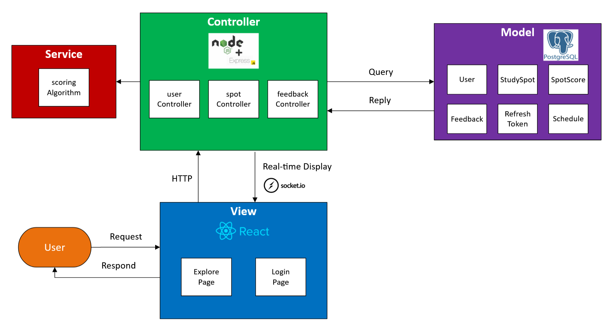

# NUSpaces

A study spot recommendation web application for NUS students.

## Motivation

It is often difficult to find quiet study spots in NUS, especially around exam periods.
While there are existing systems like uNivUS to help reserve library seats, these do
not help students decide on suitable locations around campus where they can focus
on their work without distraction. As such, we want to create an application that is
able to find conducive study spots for NUS students.

## Aim 

Our project aims to support students in locating quiet and conducive study spaces on
campus using real-time data, thereby improving their overall studying experience.
Students will be able to more easily find suitable study spots near them rather than
wander around different areas to check for seats, saving them precious study time.

---

## Tech Stack

| Layer | Technology | Purpose |
|:--- |:--- |:--- |
| Frontend | React (Vite) | Component-based UI with fast development |
| Styling | CSS | Custom styling |
| Backend | Node.js + Express | REST API, application logic, scheduled tasks |
| Database | PostgreSQL | Relational data storage |
| Authentication | JWT + bcrypt | Secure authentication with access/refresh tokens |
| Validation | Zod | Schema-based input validation |
| Scheduling | node-cron | Periodic score recalculation |
| Real-time Update | socket.io | Web socket real-time communication (to be implemented) |
| Version Control | GitHub | Source control and collaboration |

---

# Features

## 1. Authentication

The authentication features include Register, Login and Logout. A new user is able to register their email, username and password on the website and the user data will be saved into the database. The user will then be able to login to their account with their email and password. Authentication is required to submit feedback.

### Registration

Users can create an account with the following requirements:

| Field | Requirements |
|:--- |:--- |
| Username | 3 – 50 characters, alphanumeric and underscores only |
| Email | Must be valid NUS email domain (@u.nus.edu or @nus.edu.sg) |
| Password | Minimum 8 characters, at least one letter and one number |

API Used:
```
POST /api/auth/register
```

### Login

Users can log in with their email and password. Logged in users are able to submit feedback.

Required fields:
1. Email
2. Password

API Used:
```
POST /api/auth/login
```

### Logout

The user is able to log out of their account and end the session. This clears the authentication cookies and revokes the refresh token in the database so it cannot be reused or leaked.

API Used:
```
POST /api/auth/logout
```

### Login Page  

* User can log in with valid backend account
* User can switch to Register mode
* Register requires username, email, and password
* Error message appears for invalid login
* After login, user returns to Explore page

### Authentication Security

#### JSON Web Tokens (JWT)

JWT Authentication uses a dual-token strategy. A short-lived access token (15 minutes) is used for API requests, while a long-term refresh token (7 days) keeps users logged in without having to re-enter login details on refresh. Both tokens are stored as httpOnly cookies, which prevents JavaScript from reading them and protects against XSS attacks. The refresh token is also stored in the database, allowing server-side revocation during logout.

#### bcrypt 

Passwords are hashed using bcrypt before being stored in the database. Plain-text passwords are never stored to prevent password leaks. During login, the user inputted password is verified by comparing against the stored hash using `bcrypt.compare()`.

#### Zod 

All HTTP request data is validated using Zod schemas before reaching the controllers. Zod is used to enforce type checking, string constraints, and requirements (such as password length requirement and NUS email domain validation), and sanitises all text inputs by trimming whitespace and normalizing email casing. Invalid requests are rejected and specified error messages are given back to the client (such as “Invalid password” or “Username is taken”).

## 2. Real-time Scoring Algorithm

The quietness and crowd scoring algorithm utilises user-provided data to calculate the noise and crowd level of each study spot in NUS. The algorithm has a time-decay weighting, where older data have lower weightage on the scores, ensuring that displayed conditions reflect recent activity.

### Score Formula

```
quietness_score = Σ(noise_value × weight) / Σ(weight)
```

Where:
- `noise_value = (noise_level - 1) × 25` (normalizes the 1 – 5 user rating to a 0 – 100 scale)
- `weight = max(0.1, e^(-0.05 × days_old))` (exponential time decay)
- `0.1 floor weight` (ensures historical/old data is still relevant)

### Time-of-Day Filtering

The algorithm only considers feedback submitted within a configurable time window (±1 hours) of the current time, across all dates. This ensures that scores reflect the noise and crowd level at that specific time of the day.

### Score Update Triggers

Scores are recalculated in two ways:
1. **Every 15 minutes** via a scheduled CRON job
2. **Automatically updates** whenever a student submits new feedback for a spot

## 3. Status Display

### Explore Page

The Explore Page displays the following:

- Study spaces loaded from backend
- Quietness score with category label
- Crowd levels shown as `/5`, not `/100`
- Refresh Data button calls backend refresh API to recalculate all scores
- Login button appears at top right when logged out
- Username and Logout button appear when logged in

### Quietness Score Display

Displays study spaces from the backend with:

- Location and building name
- Quietness score (category)
- Crowd level
- Available amenities (power outlets, air conditioning)
- Open/Closed status of location

#### Noise categories

The Explore page supports these quietness filters:

- All
- Very Quiet
- Quiet
- Moderate
- Noisy
- Very Noisy

The frontend maps backend `quietness_score` values into labels:

| Score Range | Label |
|:----:|:----:|
| 0 – 12.5 | Very Quiet |
| 12.5 – 37.5 | Quiet |
| 37.5 – 62.5 | Moderate |
| 62.5 – 87.5 | Noisy |
| 87.5 – 100 | Very Noisy |

### Crowd Level Display


The backend may return a crowd score on a 0 – 100 scale based on the same time-weighted scoring algorithm as the quietness score. The frontend converts it back into a 1 – 5 scale using: crowd level = avg_crowd / 25 + 1

#### Examples

| Score | Crowd Level |
|:----:|:----:|
| 0 | 1.0 / 5 |
| 25 | 2.0 / 5 |
| 50 | 3.0 / 5 |
| 75 | 4.0 / 5 |
| 100 | 5.0 / 5 |

This prevents the frontend from wrongly showing the crowd level as `/100` when the UI expects `/5`.  

—  

## 4. Feedback System

Feedback can be provided for each study spot with a noise and crowd level (from 1 – 5) and an optional comment. This feedback data is used to calculate the scores for each location. After each feedback submission, the score is automatically recalculated, ensuring the most up-to-date scoring possible.  

Restrictions:
- Users must be logged in to submit feedback
- A 30-minute cooldown prevents the same user from submitting multiple reports for the same spot
- Noise and crowd values are validated to be integers between 1 and 5

API Used:
```
POST /api/feedback
```

—

## 5. Search and Filter

The search and filter feature enables users to narrow down study spots to what they find ideal using: 
- **Text search**: search for name of study spot, building, or faculty
- **Quietness filter**: filter by category (Very Quiet, Quiet, Moderate, Noisy, Very Noisy)
- **Type filter**: filter by space type (library, study room, outdoor, lounge, lab)

# Architecture and Flow

## Model-View-Controller (MVC) Architecture



## Database (PostgreSQL)

### Tables

| Table | Purpose |
|:--- |:--- |
| `users` | Registered NUS students |
| `refresh_tokens` | Active refresh tokens for session management |
| `study_spots` | Physical study locations on campus |
| `spot_schedules` | Regular weekly opening hours per spot |
| `spot_schedule_overrides` | Date-specific schedule exceptions |
| `feedback` | Student noise and crowd reports |
| `spot_scores` | Pre-computed quietness and crowd scores |

## Frontend Flow

```
ExplorePage loads  
↓  
Calls GET /api/spots  
↓  
Backend returns study space data  
↓  
Frontend displays cards  
```

## Register Flow

```
User enters email and password
↓
Frontend calls POST /api/auth/register
↓
Backend validates user
↓
Backend generates authentication cookies & tokens
↓
Frontend stores user information
↓
User returns to Explore page
```

## Login Flow

```
User enters email and password  
↓  
Frontend calls POST /api/auth/login  
↓  
Backend validates user credentials
↓  
Backend generates authentication cookies & tokens
↓  
Frontend stores user information  
↓  
User returns to Explore page  
```

## Feedback Flow

```
User enters noise level (1–5), crowd level (1–5), and optional comment
↓  
Frontend calls POST /api/feedback
↓  
Backend validates input and saves feedback
↓  
Backend recalculates the study spot’s scores
↓  
Frontend refreshes data and shows updated scores
```

## Demo

[Watch the Demo Video](https://drive.google.com/file/d/1guGV5fSVefILQaDfOtRou0UaTen2Q7wt/view?usp=sharing)

## Getting Started 

### Prerequisites

- [Node.js](https://nodejs.org/) (v18 or later)
- [PostgreSQL](https://www.postgresql.org/download/) (v14 or later)
- [Git](https://git-scm.com/)

### Setup

```bash
# Clone repo
git clone https://github.com/lyingflame/NUSpaces-Orbitall-
cd NUSpaces-Orbitall-

# Install dependencies (backend + frontend)
npm run install-all

# Add .env files (change server/.env DB user or password if needed)
cp client/.env.exampme client/.env
cp server/.env.example server/.env
```

### Database

```bash
# Create PostgreSQL database
psql -U postgres
CREATE DATABASE nuspaces;
\q

# Run migrations to create tables
npm run db:migrate

# Seed database with test data
npm run db:seed
```

### Executing program

```bash
# Run frontend + backend
npm run dev
```

The backend runs on `http://localhost:5000` and the frontend on `http://localhost:5173`.

# Project Information

**Project ID: 6843**  
**Project Name: NUSpaces**  

## Team Members 

Royston Chew Yi De  
Lennon Chow Yang Jie  
